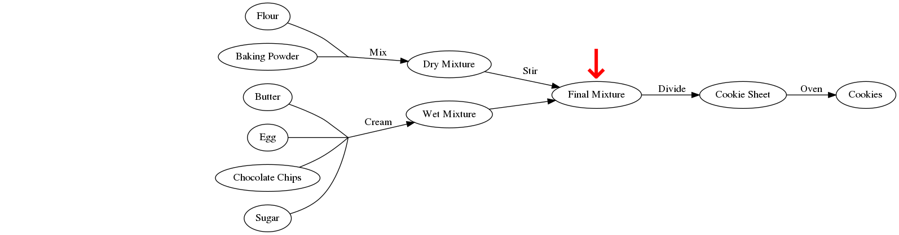

```{r setup, include=FALSE}
library(DiagrammeR)
library(stringr)
options(htmltools.dir.version = FALSE)
knitr::opts_chunk$set(
  fig.width=9, fig.height=3.5, fig.retina=3,
  out.width = "100%",
  cache = FALSE,
  echo = TRUE,
  message = FALSE, 
  warning = FALSE,
  hiline = TRUE
)
```

```{r xaringan-themer, include=FALSE, warning=FALSE}
library(xaringanthemer)
style_duo_accent(
  primary_color = "#1381B0",
  secondary_color = "#FF961C",
  inverse_header_color = "#FFFFFF",
  text_font_size = "1.25rem"
)

```

class: center, middle, inverse

# Lesson 1

---

## Lesson 1

1. Why Snakemake?
2. Introducing Workflows
3. Workflow Syntax
4. Running Snakemake
5. Assignment 1

Preparation for Assignment 1:
```bash
sbatch -c 1 --mem 4G -J conda --wrap \
"conda create -n prokka -c conda-forge -c bioconda prokka"

sbatch -c 1 --mem 4G -J conda --wrap \
"conda create -n pirate -c bioconda -c conda-forge pirate"
```

---

## Why Snakemake?

.left-column[

**Automation**

Reproducibility

Others' Snakefiles

]

.right-column[
Front-loading your effort.

Modest investment at the beginning of a project yields a hands-off tool for
performing routine analyses.

Snakemake will only run what it needs to - will only evaluate what changes.
]

---

## Why Snakemake?

.left-column[

Automation

**Reproducibility**

Others' Snakefiles

]

.right-column[
Guarantee that the same inputs will give the same outputs.

Altering an input will make Snakemake re-evalutate any outputs that depend upon it.

Built-in version tracking.
]

---

## Why Snakemake?

.left-column[

Automation

Reproducibility

**Others' Snakefiles**

]

.right-column[
Understand and modify the tools others have created for you.
]

---

## Baking Cookies

```{r, echo=FALSE, fig.align='center', out.width='40%'}

knitr::include_graphics("figures/cookie.jpg")
```

.footnote[Procsilas Moscas - Wikimedia Commons]

---

## Baking Cookies by Following a "Script"

.pull-left[
1. _Mix_ **flour** & **baking powder** in a bowl

2. _Cream_ **butter**, **egg**, **chocolate chips**, and **sugar** in another bowl

3. _Stir_ the **two bowls** together

4. _Divide_ **dough blobs** onto a cookie sheet

5. Bake in an _oven_ to get **cookies**
]

--

.pull-right[
- We can follow a linear recipe start-to-finish

- Imagine a robot following these steps
    - Follows instructions, but can only run in sequence
    - If the eggs were spoiled, it would get new eggs and start from the very beginning
]
---
## Baking with Graphs


---
## Thinking Backwards

- Snakemake lessons/figures out how to achieve the desired result:
  - starts at the final product
  - works backwards until it finds what it needs

--

- A **collection of relationships** not a **sequence of instructions**

- You tell it how to convert each input to each output

---
## Thinking Backwards


---
## Thinking Backwards


---
## Thinking Backwards



---
## Thinking Backwards


---
## Thinking Backwards


---
## Thinking Backwards


---
## Rules for Baking

```python
rule all:
    input: "cookies"

rule bake_cookies:
    input: "pan/dough.blobs"
    output: "cookies"
    shell: "oven -i {input} -o {output} --temp 350 --time 15"

rule apportion_dough_blobs:
    input: "bowls/final.mix"
    output: "pan/dough.blobs"
    shell: "scoop -n 24 {input} > {output}"
    
rule combine_bowls:
    input: wet="bowls/wet.mix", dry="bowls/dry.mix"
    output: "bowls/final.mix"
    shell: "mixer {input.wet} {input.dry} > {output}"
```
---
## Rules for Baking

- The `all` rule is the final target, and written first

- Each rule specifies its `input` and `output`

- The `shell` command defines how the `input` becomes the `output`

- Snakemake matches up `input` and `output` for all the rules until it can generate `all`

---
## Baking → Bioinformatics
```{r, basic-mlst-workflow, echo=FALSE}
binfx_dot_simple <- '
digraph {
  rankdir=LR;
  fastq[label="FASTQ"];
  fasta[label="Genome FASTA"];
  alleles[label="Core Alleles", shape="MRecord"];
  calls[label="Calls Table"];
  
  dummy[shape=point, width=0.01, height=0.01];
  fastq -> fasta [label = "SPAdes"];

  alleles -> dummy[dir = none, style="dashed"];
  fasta -> dummy[dir = none];
  dummy -> calls[label = "MLST"];
  
}
'
grViz(binfx_dot_simple)
```

---
## Multiple Samples

```{r, echo=FALSE}
binfx_dot_expanded <- '
digraph {
rankdir=LR;
alleles[label="alleles/aspA.fasta … uncA.fasta", shape=MRecord];
calls[label="calls.tsv"];

fastqA[label="fastqs/genomeA.fastq"];
fastqB[label="fastqs/genomeB.fastq"];
fastqC[label="fastqs/genomeC.fastq"];

fastaA[label="assemblies/genomeA/contigs.fasta"];
fastaB[label="assemblies/genomeB/contigs.fasta"];
fastaC[label="assemblies/genomeC/contigs.fasta"];

mlstA[label="mlst_results/genomeA.tsv"];
mlstB[label="mlst_results/genomeB.tsv"];
mlstC[label="mlst_results/genomeC.tsv"];

fastqA -> fastaA [label="SPAdes"];
fastqB -> fastaB [label="SPAdes"];
fastqC -> fastaC [label="SPAdes"];

dummyA[shape=point, width=0.01, height=0.01];
dummyB[shape=point, width=0.01, height=0.01];
dummyC[shape=point, width=0.01, height=0.01];
dummyD[shape=point, width=0.01, height=0.01];

fastaA -> dummyA [dir=none];
fastaB -> dummyB [dir=none];
fastaC -> dummyC [dir=none];
alleles -> {dummyA, dummyB, dummyC} [dir=none, style="dashed"];

dummyA -> mlstA [label="MLST"];
dummyB -> mlstB [label="MLST"];
dummyC -> mlstC [label="MLST"];

{mlstA, mlstB, mlstC} -> dummyD [dir=none];
dummyD -> calls [label="combine"];
}
'

grViz(binfx_dot_expanded)
```
---
## Multiple Samples

- Recall that rules are only executed if their inputs update or outputs are missing

- Lets you run jobs without worrying you'll waste effort

--

### MLST Example from Above

1. If you have 1000 genomes and run the above MLST rule, it will calculate 1000 calls, and build the calls table
2. If you add 1 more genome, and rerun snakemake, only a single MLST will run, and the calls table is rebuilt

---
## Wildcards

- We can match every file with particular naming pattern with wildcards

- In a rule, wrap a variable name with curly braces
    - _e.g._ `{sample}`

--

- Rule is applied in parallel to each file matching the rule

--

- In `shell` block, you can access these when preceded by `wildcards`
    - _e.g._ `{wildcards.sample}`

---
## Expanding patterns

- The `expand()` function can be useful for taking a pattern and using it to get many files matching that pattern

--

```python
# get sample names from starting fastas:
# genomes/foo.fasta, genome/bar.fasta, genome/baz.fasta
from pathlib import Path
samples = [p.stem for p in Path("genomes").glob("*.fasta")]
# samples = ["foo", "bar", "baz"]

rule all:
    input: "aggregated_results.txt"

rule process_single_genome:
    input: "genomes/{sample}.fasta"
    output: "results/{sample}.txt"
    shell: "frobnicate {input} > {output}"

rule takes_many_files:
    input: expand("results/{sample}.txt", sample=samples)
    output: "aggregated_results.txt"
```
---
## Rules for Multiple Samples

```python
from pathlib import Path
sample_names = [fq.stem for fq in Path("fastqs").glob("*")]

rule all:
    input: "calls.tsv"
    
rule assemble:
    input:
        fwd="fastqs/{sample}/{sample}_1.fastq", rev="fastqs/{sample}/{sample}_2.fastq"
    output: "assemblies/{sample}/contigs.fasta"
    shell: "spades -1 {input.fwd} -2 {input.rev} -o assemblies/{wildcards.sample}"

rule get_sequence_types:
    input: "assemblies/{sample}/contigs.fasta"
    output: "mlst_results/{sample}.tsv"
    shell: "mlst --scheme campylobacter {input} > {output}"
    
rule combine_mlst_results:
    input: expand("mlst_results/{sample}.tsv", sample=sample_names)
    output: "calls.tsv"
    shell: "cat {input} > {output}"
```
---
## Threads

- Many (but not all!) bioinformatics tools use multiple CPU threads
- `threads` directive defaults to `1`
    - Accessible in the `shell` block, similar to `input` and `output`
      - `{threads}`

--

```python
rule annotate_genome:
    input: "genomes/{sample}.fasta"
    output: "annotations/{sample}/{sample}.gff"
    threads: 8
    shell: 
        "prokka --force --prefix {wildcards.sample} "
        "--cpus {threads} -o annotations/{wildcards.sample} {input}"
```

--

.footnote[
You can split the `shell` block over multiple lines.
Leave a space at the end of each chunk!
]
---
## Caveats and Assumptions

### Directory Structure

- Snakefiles themselves can live anywhere
    - I keep mine in `~/snakefiles/`

--

- Workflows tightly coupled to its directory structure
    - The structure applies to the specified project directory

--

- Will implicitly create any directories it needs
    - No need for `mkdir`


---
## Directory Structure
This rule…

```python
rule annotate_genome:
    input: "genomes/{sample}.fasta"
    output: "annotations/{sample}/{sample}.gff"
    threads: 8
    shell:
        "prokka --force --prefix {wildcards.sample} "
        "--cpus {threads} -o annotations/{wildcards.sample} {input}"
```
--
_requires_ this structure:

```
analysis/
├── genomes/
│  ├── isolateA.fasta
│  ├── isolateB.fasta
│  └── isolateC.fasta
└── annotations/
    ├── isolateA.fasta
    ├── ...
```

---
## Caveats and Assumptions
### Independent Jobs

- Failure of _any_ job will abort _all_ other jobs
    - Default behaviour

--

- Override with `--keep-going`

--
    - Dependent jobs will still await all inputs
    - _e.g._ if stiring the dry cookie mixture fails, the wet mixture still gets made, but nothing goes in the oven
--
    - (I usually do this for routine work)
---

## Running Snakemake (Basic)

The **basic invocation** of Snakemake:
```bash
snakemake --jobs <number of parallel jobs> -s <path to your Snakefile> -d <work directory>
```

--

Example populated with real values:
```bash
snakemake --jobs 5 -s ~/snakefiles/assemble.smk -d ~/Projects/cj_population_study
```
---

## Running Snakemake on Waffles

- Snakemake can be run on HPCs like **Waffles**

  - _Must_ be combined with Slurm if you're on Waffles
    - _Don't run it on the head node!_

--

### Two Parts for Cluster Submission 

--

1. Tell Snakemake how to submit jobs with `--cluster`

--

2. Submit `snakemake` itself as a Slurm job

---
## Running Snakemake on Waffles

The `--cluster` argument:

- Create a template to pass to **Slurm**

- May access Snakemake special variables like `{threads}`
    - **More on this next lesson**
    
`--cluster 'sbatch -c {threads} --mem 12G --partition NMLResearch '`

---
## Running Snakemake on Waffles

Submitting the Snakemake job to Slurm:

`sbatch -c 1 --mem 4G --wrap "snakemake --jobs 5 -s ~/snakefiles/assemble.smk -d ~/Projects/cj_population_study --cluster 'sbatch -c {threads} --mem 12G --partition NMLResearch '"`
---
## Assignment 1

### Get The Test Data on Waffles

```bash
cp -r /Drives/W/Projects/CampyLab/snakemake-intro-data/ ~/snakemake-intro-data

# Or if you don't have access to Projects
cp -r /Drives/W/Temporary/snakemake-intro-data/ ~/snakemake-intro-data
```

### If You're Not Using Waffles
```bash
url="https://github.com/dorbarker/snakemake-intro/blob/main/data/snakemake-intro-data.zip"
fn="$HOME/snakemake-intro-data.zip"

curl -o $fn $url || wget -O $fn $url
unzip $fn
```

---
## Assignment 1

Write a Snakemake workflow that does the following:

1. Run Prokka on each genome
2. Symlink GFF annotations into `gffs/`
3. Build a pangenome with PIRATE

```bash
conda activate prokka
conda activate --stack pirate
```

Everything you need is in today's presentation:

https://github.com/dorbarker/snakemake-intro/blob/main/lessons/snakemake-intro-lesson-1.pdf

---
## Assignment 1 Hints

- Invoking PIRATE to generate nucleotide-based pangenome:
    - `PIRATE --input gffs/ --output pangenome/ --nucl --threads {threads}`

- PIRATE produces many files, but you can rely on `PIRATE.gene_families.tsv` being created

- You'll need to `expand()` your inputs to make sure all the GFF files are present
