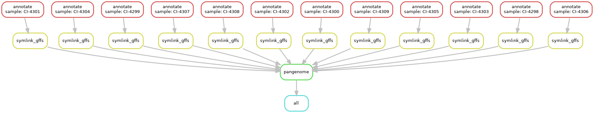

```{r setup, include=FALSE}
library(DiagrammeR)
library(stringr)
options(htmltools.dir.version = FALSE)
knitr::opts_chunk$set(
  fig.width=9, fig.height=3.5, fig.retina=3,
  out.width = "100%",
  cache = FALSE,
  echo = TRUE,
  message = FALSE, 
  warning = FALSE,
  hiline = TRUE
)
```

```{r xaringan-themer, include=FALSE, warning=FALSE}
library(xaringanthemer)
style_duo_accent(
  primary_color = "#1381B0",
  secondary_color = "#FF961C",
  inverse_header_color = "#FFFFFF",
  text_font_size = "1.25rem"
)

```

class: inverse, center, middle
name: lesson2

# Lesson 2
## 2021-10-20

---
## Lesson 2

1. Erratum
2. Wildcards by Analogy
3. Assignment 1 Answers
4. Conda Integration
5. Params and Configuration
6. Local Rules
7. Mixing in Python
8. Assignment 2

---
## Erratum

### I put the wrong Genbank file in the tutorial data; please update!

#### Waffles
```bash
cp /Drives/W/Projects/CampyLab/snakemake-intro-data/NCTC11168.gbk ~/snakemake-intro-data
# OR
cp /Drives/W/Temporary/snakemake-intro-data/NCTC11168.gbk ~/snakemake-intro-data
```

#### Not-Waffles
```bash
url="https://github.com/dorbarker/snakemake-intro/blob/main/data/snakemake-intro-data.zip"
fn="$HOME/snakemake-intro-data.zip"

curl -o $fn $url || wget -O $fn $url
unzip $fn
```

---
## Wildcards by Analogy

**Snakemake**
```python
rule process_item:
    input: "genomes/{isolate}.fasta"
    output: "results/{isolate}.txt"
    shell: "turboencabulate --sample-name {wildcards.isolate} -i {input} -o {output}" 
```
**Bash `for`-loops**
```bash
for genome in genomes/*.fasta; do
    isolate=$(basename $genome .fasta)
    turboencabulate --sample-name $isolate -i $genome -o results/${isolate}.txt
done
```
**GNU Parallel**
```bash
parallel "turboencabulate --sample-name {/.} -i {} -o results/{/.}.txt" ::: genomes/*.fasta
```

---
```python
from pathlib import Path
samples = [p.stem for p in Path("genomes").glob("*.fasta")]

rule all:
    input: "pangenome/PIRATE.gene_families.tsv"

rule annotate:
    input: "genomes/{sample}.fasta"
    output: "annotations/{sample}/{sample}.gff"
    threads: 8
    shell:
        "prokka --force --cpus {threads} "
        "--prefix {wildcards.sample} --outdir annotations/{wildcards.sample} "
        "{input}"

rule symlink_gffS:
    input: "annotations/{sample}/{sample}.gff"
    output: "gffs/{sample}.gff"
    threads: 1
    shell: "ln -sr {input} {output}"

rule pangenome:
    input: expand("gffs/{sample}.gff", sample=samples)
    output: "pangenome/PIRATE.gene_families.tsv"
    threads: 8
    shell: "PIRATE --input gffs/ --output pangenome/ --nucl --threads {threads}"
```
---
## Assignment 1 Graph



---
## Conda Integration

- Snakemake can manage `conda` directly
    - Installation
    - Activation

--

- Advantages of **automation** and **reproducibility**
    - No need to manually manage conda environments at the command line
    - Version tracking for software

---

## Using Conda in Rules
```python
rule annotate_genome:
    input: "genomes/{sample}.fasta"
    output: "annotations/{sample}/{sample}.gff"
    conda: "envs/prokka.yaml"
    shell:         
        "prokka --force --prefix {wildcards.sample} "
        "--cpus {threads} -o annotations/{wildcards.sample} {input}"
```
---

## Conda YAML files

- Placed **relative to the Snakefile**, _not_ the project directory

```python
# annotate.smk
rule annotate_genome:
    input: "genomes/{sample}.fasta"
    output: "annotations/{sample}/{sample}.gff"
    conda: "envs/prokka.yaml"
    shell:         
        "prokka --force --prefix {wildcards.sample} "
        "--cpus {threads} -o annotations/{wildcards.sample} {input}"
```

The above will look for the following directory structure:

```sh
snakefiles/
    ├── annotate.smk
    └── envs/
        └── prokka.yaml
```
---
## Conda YAML files
  
This YAML file …
```yaml
name: prokka
channels:
    - conda-forge
    - bioconda
    - defaults
dependencies:
    - prokka
```

--

… is equivalent to this conda command:
```sh
conda create --name prokka -c conda-forge -c bioconda -c defaults prokka
```
---
## Using Conda Directives with Snakemake

- Must explicitly tell Snakemake to use Conda

```sh
snakemake --use-conda <…>
```

- Automatic installation and activation

---
## Config

- Available through two methods
    - `--config` passes arguments directly via command line
    - `--configfile` points to a YAML file that provides values
        
--

`--config key="value" number=5` is equivalent to `--configfile config.yaml` where…

```yaml
# config.yaml
key: "value"
number: 5
```

--
- Python `dict` available within the Snakefile
    - Access as `config["key"]` inside the workflow
---
## Config

We can use `config` to provide different Genbank files for different species

```python
gbk_file = config["proteins"]

rule annotate:
    input: "genomes/{sample}.fasta"
    output: "annotations/{sample}/{sample}.gff"
    threads: 8
    params: outdir="annotations/{sample}"
    shell:
        "prokka --force --cpus {threads} "
        "--prefix {wildcards.sample} --outdir {params.outdir} "
        "--proteins {gbk_file} "
        "{input}"
```

---

## Configfile

- May also set a default path with `configfile` directive in workflow

- Defaults are overridden by anything provided at the command line

```python
configfile: "analysis_config.yaml"

rule all:
    input: "results.txt"

...
```
---
class: middle

## Configuration via:
.pull-left[
`--config`:
    - ↓ effort
    - ↑ flexible
    - ↓ reproducible
]
.pull-right[
YAML file:
    - ↑ effort
    - ↓ flexible
    - ↑ reproducible
]
---
## Params

- Non-file parameters may be provided in the `params` directive

```python
rule annotate:
    input: "genomes/{sample}.fasta"
    output: "annotations/{sample}/{sample}.gff"
    threads: 8
    params: outdir="annotations/{sample}"
    shell:
        "prokka --force --cpus {threads} "
        "--prefix {wildcards.sample} --outdir {params.outdir} "
        "{input}"
```
---
## Slurm Resources on the Cluster

##### `mem` - Memory
- The amount of RAM provisioned to a job
    - `12G` → May use a maximum of 12 gigabytes memory
    - Valid suffixes: `K` `M` `G` `T`

--

##### `time` - Maximum Duration
- Maximum length of time a job can run
    - `"minutes"`
    - `"minutes:seconds"`
    - `"hours:minutes:seconds"`
    - `"days-hours"`
    - `"days-hours:minutes"`
    - `"days-hours:minutes:seconds"`
---
## Abusing Params to Fine-tune Resources

```python
rule annotate_genome:
    input: "genomes/{sample}.fasta"
    output: "annotations/{sample}/{sample}.gff"
    threads: 8
    params:
        time="45:00",
        mem="12G"
    shell:         
        "prokka --force --prefix {wildcards.sample} "
        "--cpus {threads} -o annotations/{wildcards.sample} {input}"

rule symlink_gff:
    input: "annotations/{sample}/{sample}.gff"
    output: "gffs/{sample}.gff"
    threads: 1
    params:
        time="01:00",
        mem="100M"
    shell: "ln -sr {input} {output}"
```
---

## Abusing Params to Fine-tune Resources
```sh
snakemake <…> --cluster 'sbatch -c {threads} --mem {params.mem} --time {params.time} '
```
--
### Considerations
- Resource requirements will travel with your workflow

- Be mindful of the effect of _e.g._ genome size
    - Can always set `params` with `config`!

- If you use `params` to specify resources, you must do it for _every rule **submitted**_ to the cluster
    - Not `all` or any **local** rules
        - (more in a moment)

---
## Config vs Params

- Params are fairly "fixed"
    - Used primarily to simplify `shell` block

- Config for context-specific information
    - _ e.g._ providing a particular host database to `kat`, training file to `chewBBACA`, or Genbank file to `prokka`

---
## Local Rules

- Not every job is worth submitting as its own job to the cluster
    - Undemanding jobs, like symlinking files or the `all` rule

--

- Rules can be marked as **local** 
    - Run in the same process as `snakemake`

--

- List rule names in `localrules` directive

---
## Local Rules

```python
from pathlib import Path
samples = [p.stem for p in Path("fastqs").glob("*")]

localrules: all, symlink_fastas

rule all:
    input: expand("genomes/{sample}.fasta", sample=samples)

rule assemble:
    input:
        fwd="fastqs/{sample}/{sample}_1.fastq", rev="fastqs/{sample}/{sample}_2.fastq"
    output: "assemblies/{sample}/contigs.fasta"
    shell: "spades -1 {input.fwd} -2 {input.rev} -o assemblies/{wildcards.sample}"

rule symlink_fastas:
    input: "assemblies/{sample}/contigs.fasta"
    output: "genomes/{sample}.fasta"
    shell: "ln -sr {input} {output}"
```
---
## Mixing in Python

- Python may be mixed in arbitrarily into Snakemake
    - _i.e._ All Python is valid Snakemake

- Two main ways of using Python in Snakemake
    - `run` blocks
    - Python used directly in the Snakemake file


.footnote[Python → Snakemake, get it‽]

---
## Run blocks

- `run` blocks can be used in place of `shell` blocks

- Write Python inside the `run` block, rather than Bash in a `shell` block

- May access snakemake values like `input` and `output`

```python
rule extract_and_filter_columnA:
    input: "data/results_table.tsv"
    output: "data/columnA_filtered.tsv"
    run:
        import pandas as pd
        data_table = pd.read_csv(input[0], sep = "\t")
        # select rows from columnA where columnC is greater than 42
        selected_rows = data_table["columnC"] > 42
        selected_columnA = data_table["columnA"].loc[selected_rows]
        selected_columnA.to_csv(output[0], header=False)
```

---

## Directly Using Python in Snakemake

- You can directly use Python in Snakemake

- Particularly useful for handling cases where a rule generates variable output
    - _e.g._ The number of gene FASTAs generated by a pangenome analysis

- Can provide a Python function to `input` instead of a file pattern

---

- `select_high_quality_genomes` takes a list of FASTAs, then symlinks
high-quality ones into `./good_genomes/` and writes a report called
`quality_report.txt`

- We don't know in advance which genomes will pass QC, so we need an input
function

```python

rule quality_filter_genomes:
    input: expand("genomes/{sample}.fasta", sample=samples)
    output: "quality_report.txt"
    shell: "select_high_quality_genomes {input} > {output}"

# input functions need to take parameter `wildcards`
def collect_good_genome_sample_names(wildcards):
    good_genomes = Path("good_genomes/").glob("*.fasta")
    return list(good_genomes)

# use the report as a dummy input to make sure quality_filter_genomes executes
rule run_abricate:
    input: report="quality_report.txt", fastas=collect_good_genome_sample_names
    output: "amr_results.tsv"
    shell: "abricate {input.fastas} > {output}"
```
---
## Assignment 2 - Building Upon Assignment 1
1. Create conda YAMLs for `prokka` and `pirate`
    - Remember where snakemake looks for them!

2. Give appropriate `time` and `mem` resources to each rule with `params`

3. Write a rule with a `run` block that reads `PIRATE.gene_families.tsv`, finds loci present in 100% of genomes, and writes their names to `core_loci.txt`
    - columns of interest: `gene_family` & `number_genomes`

4. Provides a GBK file to `prokka`'s `--proteins` argument via `--config` or `--configfile`

5. Change your symlinking rule to be a **local** rule

---

## Assignment 2 Hints

- How has your `all` rule changed?

- Think about how much memory and time needs to be allocated for different rules

### PDF Version of Today's Lecture

https://github.com/dorbarker/snakemake-intro/blob/main/lessons/snakemake-intro-lesson-2.pdf

### Answer Key to Assignment 1
https://github.com/dorbarker/snakemake-intro/blob/main/answer_keys/asn-1.smk
