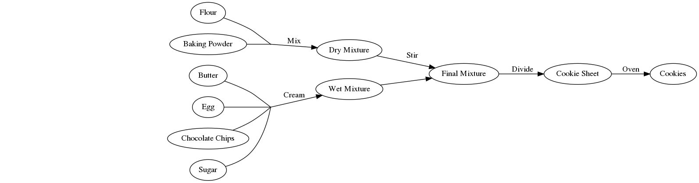
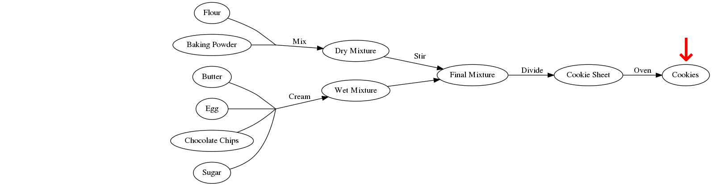
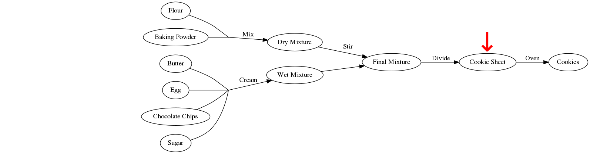
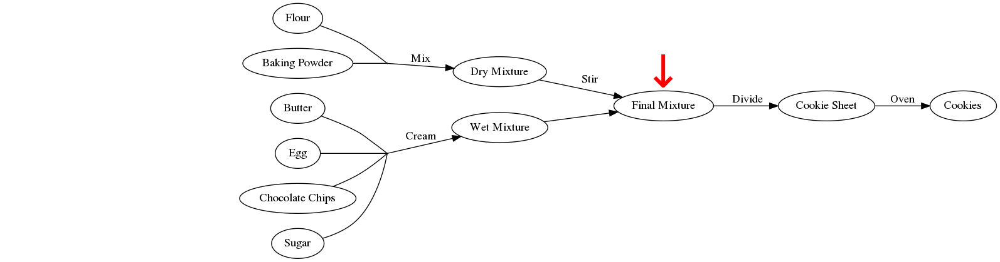
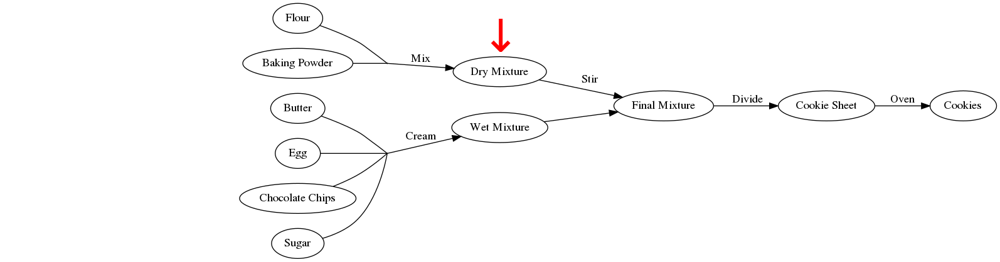
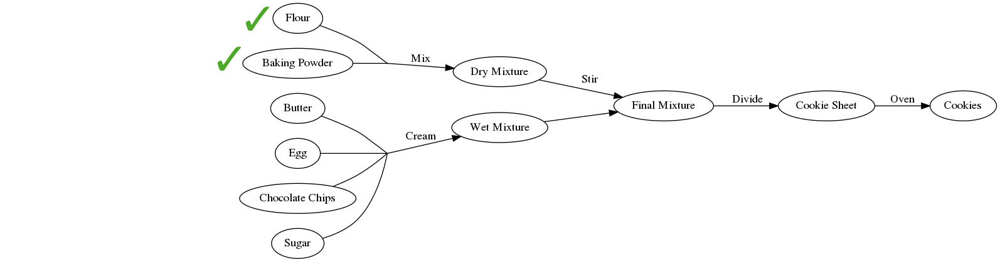

```{r setup, include=FALSE}
library(DiagrammeR)
library(stringr)
options(htmltools.dir.version = FALSE)
knitr::opts_chunk$set(
  fig.width=9, fig.height=3.5, fig.retina=3,
  out.width = "100%",
  cache = FALSE,
  echo = TRUE,
  message = FALSE, 
  warning = FALSE,
  hiline = TRUE
)
```

```{r xaringan-themer, include=FALSE, warning=FALSE}
library(xaringanthemer)
style_duo_accent(
  primary_color = "#1381B0",
  secondary_color = "#FF961C",
  inverse_header_color = "#FFFFFF",
  text_font_size = "1.25rem"
)

```

## Lesson 1

1. Why Snakemake?
2. Introducing Workflows
3. Workflow Syntax
4. Running Snakemake
5. Assignment 1

Preparation for Assignment 1:
```bash
sbatch -c 1 --mem 4G -J conda --wrap \
"conda create -n prokka -c conda-forge -c bioconda prokka"

sbatch -c 1 --mem 4G -J conda --wrap \
"conda create -n pirate -c bioconda -c conda-forge pirate"
```

---

## Why Snakemake?

.left-column[

**Automation**

Reproducibility

Others' Snakefiles

]

.right-column[
Front-loading your effort.

Modest investment at the beginning of a project yields a hands-off tool for
performing routine analyses.

Snakemake will only run what it needs to - will only evaluate what changes.
]

---

## Why Snakemake?

.left-column[

Automation

**Reproducibility**

Others' Snakefiles

]

.right-column[
Guarantee that the same inputs will give the same outputs.

Altering an input will make Snakemake re-evalutate any outputs that depend upon it.

Built-in version tracking.
]

---

## Why Snakemake?

.left-column[

Automation

Reproducibility

**Others' Snakefiles**

]

.right-column[
Understand and modify the tools others have created for you.
]

---

## Baking Cookies

```{r, echo=FALSE, fig.align='center', out.width='40%'}

knitr::include_graphics("figures/cookie.jpg")
```

.footnote[Procsilas Moscas - Wikimedia Commons]

---

## Baking Cookies by Following a "Script"

.pull-left[
1. _Mix_ **flour** & **baking powder** in a bowl

2. _Cream_ **butter**, **egg**, **chocolate chips**, and **sugar** in another bowl

3. _Stir_ the **two bowls** together

4. _Divide_ **dough blobs** onto a cookie sheet

5. Bake in an _oven_ to get **cookies**
]

.pull-right[
- We can follow a linear recipe start-to-finish

- Imagine a robot following these steps
    - Follows instructions, but can only run in sequence
    - If the eggs were spoiled, it would get new eggs and start from the very beginning
]
---
## Baking with Graphs



---
## Thinking Backwards

- Snakemake figures out how to achieve the desired result:
  - starts at the final product
  - works backwards until it finds what it needs

- A **collection of relationships** not a **sequence of instructions**

- You tell it how to convert each input to each output

---
## Thinking Backwards



---
## Thinking Backwards



---
## Thinking Backwards



---
## Thinking Backwards



---
## Thinking Backwards



---
## Thinking Backwards


---
## Rules for Baking

```python
rule all:
    input: "cookies"

rule bake_cookies:
    input: "pan/dough.blobs"
    output: "cookies"
    shell: "oven -i {input} -o {output} --temp 350 --time 15"

rule apportion_dough_blobs:
    input: "bowls/final.mix"
    output: "pan/dough.blobs"
    shell: "scoop -n 24 {input} > {output}"
    
rule combine_bowls:
    input: wet="bowls/wet.mix", dry="bowls/dry.mix"
    output: "bowls/final.mix"
    shell: "mixer {input.wet} {input.dry} > {output}"
```
---
## Rules for Baking

- The `all` rule is the final target, and written first

- Each rule specifies its `input` and `output`

- The `shell` command defines how the `input` becomes the `output`

- Snakemake matches up `input` and `output` for all the rules until it can generate `all`

---
## Baking → Bioinformatics
```{r, basic-mlst-workflow, echo=FALSE}
binfx_dot_simple <- '
digraph {
  rankdir=LR;
  fastq[label="FASTQ"];
  fasta[label="Genome FASTA"];
  alleles[label="Core Alleles", shape="MRecord"];
  calls[label="Calls Table"];
  
  dummy[shape=point, width=0.01, height=0.01];
  fastq -> fasta [label = "SPAdes"];

  alleles -> dummy[dir = none, style="dashed"];
  fasta -> dummy[dir = none];
  dummy -> calls[label = "MLST"];
  
}
'
grViz(binfx_dot_simple)
```

---
## Multiple Samples

```{r, echo=FALSE}
binfx_dot_expanded <- '
digraph {
rankdir=LR;
alleles[label="alleles/aspA.fasta … uncA.fasta", shape=MRecord];
calls[label="calls.tsv"];

fastqA[label="fastqs/genomeA.fastq"];
fastqB[label="fastqs/genomeB.fastq"];
fastqC[label="fastqs/genomeC.fastq"];

fastaA[label="assemblies/genomeA/contigs.fasta"];
fastaB[label="assemblies/genomeB/contigs.fasta"];
fastaC[label="assemblies/genomeC/contigs.fasta"];

mlstA[label="mlst_results/genomeA.tsv"];
mlstB[label="mlst_results/genomeB.tsv"];
mlstC[label="mlst_results/genomeC.tsv"];

fastqA -> fastaA [label="SPAdes"];
fastqB -> fastaB [label="SPAdes"];
fastqC -> fastaC [label="SPAdes"];

dummyA[shape=point, width=0.01, height=0.01];
dummyB[shape=point, width=0.01, height=0.01];
dummyC[shape=point, width=0.01, height=0.01];
dummyD[shape=point, width=0.01, height=0.01];

fastaA -> dummyA [dir=none];
fastaB -> dummyB [dir=none];
fastaC -> dummyC [dir=none];
alleles -> {dummyA, dummyB, dummyC} [dir=none, style="dashed"];

dummyA -> mlstA [label="MLST"];
dummyB -> mlstB [label="MLST"];
dummyC -> mlstC [label="MLST"];

{mlstA, mlstB, mlstC} -> dummyD [dir=none];
dummyD -> calls [label="combine"];
}
'

grViz(binfx_dot_expanded)
```
---
## Multiple Samples

- Recall that rules are only executed if their inputs update or outputs are missing

- Lets you run jobs without worrying you'll waste effort

### MLST Example from Above

1. If you have 1000 genomes and run the above MLST rule, it will calculate 1000 calls, and build the calls table
2. If you add 1 more genome, and rerun snakemake, only a single MLST will run, and the calls table is rebuilt

---
## Wildcards

- We can match every file with particular naming pattern with wildcards

- In a rule, wrap a variable name with curly braces
    - _e.g._ `{sample}`

- Rule will be applied in parallel to each file matching the rule

- In `shell` block, you can access these when preceded by `wildcards`
    - _e.g._ `{wildcards.sample}`

---
## Expanding patterns

- The `expand()` function can be useful for taking a pattern and using it to get many files matching that pattern

```python
# get sample names from starting fastas
# genomes/foo.fasta, genome/bar.fasta, genome/baz.fasta
from pathlib import Path
samples = [p.stem for p in Path("genomes").glob("*.fasta")]
# samples = ["foo", "bar", "baz"]

rule all:
    input: "aggregated_results.txt"

rule process_single_genome:
    input: "genomes/{sample}.fasta"
    output: "results/{sample}.txt"
    shell: "frobnicate {input} > {output}"

rule takes_many_files:
    input: expand("results/{sample}.txt", sample=samples)
    output: "aggregated_results.txt"
```
---
## Rules for Multiple Samples

```python
from pathlib import Path
sample_names = [fq.stem for fq in Path("fastqs").glob("*")]

rule all:
    input: "calls.tsv"
    
rule assemble:
    input:
        fwd="fastqs/{sample}/{sample}_1.fastq", rev="fastqs/{sample}/{sample}_2.fastq"
    output: "assemblies/{sample}/contigs.fasta"
    shell: "spades -1 {input.fwd} -2 {input.rev} -o assemblies/{wildcards.sample}"

rule get_sequence_types:
    input: "assemblies/{sample}/contigs.fasta"
    output: "mlst_results/{sample}.tsv"
    shell: "mlst --scheme campylobacter {input} > {output}"
    
rule combine_mlst_results:
    input: expand("mlst_results/{sample}.tsv", sample=sample_names)
    output: "calls.tsv"
    shell: "cat {input} > {output}"
```
---
## Threads

- Many (but not all!) bioinformatics tools use multiple CPU threads
- `threads` directive defaults to `1`
    - Accessible in the `shell` block, similar to `input` and `output`
      - `{threads}`

```python
rule annotate_genome:
    input: "genomes/{sample}.fasta"
    output: "annotations/{sample}/{sample}.gff"
    threads: 8
    shell: 
        "prokka --force --prefix {wildcards.sample} "
        "--cpus {threads} -o annotations/{wildcards.sample} {input}"
```

.footnote[
You can split the `shell` block over multiple lines.
Leave a space at the end of each chunk!
]
---
## Caveats and Assumptions

### Directory Structure

- Snakefiles themselves can live anywhere
    - I keep mine in `~/snakefiles/`

- Workflows tightly coupled to its directory structure
    - The structure applies to the specified project directory

- Will implicitly create any directories it needs
    - No need for `mkdir`


---
## Directory Structure

This rule…

```python
rule annotate_genome:
    input: "genomes/{sample}.fasta"
    output: "annotations/{sample}/{sample}.gff"
    threads: 8
    shell:
        "prokka --force --prefix {wildcards.sample} "
        "--cpus {threads} -o annotations/{wildcards.sample} {input}"
```
_requires_ this structure:

```
analysis/
├── annotations/
│   ├── isolateA.fasta
│   ├── isolateB.fasta
│   └── isolateC.fasta
└── genomes/
    ├── isolateA.fasta
    ├── isolateB.fasta
    └── isolateC.fasta
```

---
## Caveats and Assumptions
### Independent Jobs

- Failure of _any_ job will abort _all_ other jobs
    - Default behaviour

- Override with `--keep-going` (I usually do this for routine work)
    - Dependent jobs will still await all inputs

    - _e.g._ if stiring the dry cookie mixture fails, the wet mixture still gets made, but nothing goes in the oven
---

## Running Snakemake (Basic)

The **basic invocation** of Snakemake:
```bash
snakemake --jobs <number of parallel jobs> -s <path to your Snakefile> -d <work directory>
```

Example populated with real values:
```bash
snakemake --jobs 5 -s ~/snakefiles/assemble.smk -d ~/Projects/cj_population_study
```
---

## Running Snakemake on Waffles

- Snakemake can be run on HPCs like **Waffles**
  - _Must_ be combined with Slurm
    - _Don't run it on the head node!_

- Two parts:
  1. Tell Snakemake how to submit jobs with `--cluster`
  2. Submit `snakemake` itself as a Slurm job

---
## Running Snakemake on Waffles

The `--cluster` argument:

- Create a template command to pass to **Slurm**

- May access Snakemake special variables like `{threads}`
    - **More on this later**
    
`--cluster 'sbatch -c {threads} --mem 12G --partition NMLResearch '`

---
## Running Snakemake on Waffles

Submitting the Snakemake job to Slurm:

`sbatch -c 1 --mem 4G --wrap "snakemake --jobs 5 -s ~/snakefiles/assemble.smk -d ~/Projects/cj_population_study --cluster 'sbatch -c {threads} --mem 12G --partition NMLResearch '"`
---
## Assignment 1

### Get The Test Data on Waffles

```bash
cp -r /Drives/W/Projects/CampyLab/snakemake-intro-data/ ~/snakemake-intro-data

# Or if you don't have access to Projects
cp -r /Drives/W/Temporary/snakemake-intro-data/ ~/snakemake-intro-data
```

### If You're Not Using Waffles
```bash
url="https://github.com/dorbarker/snakemake-intro/blob/main/data/snakemake-intro-data.zip"
fn="$HOME/snakemake-intro-data.zip"

curl -o $fn $url || wget -O $fn $url
```

---
## Assignment 1

Write a Snakemake workflow that does the following:

1. Run Prokka on each genome
2. Symlink GFF annotations into `gffs/`
3. Build a pangenome with PIRATE

```bash
conda activate prokka
conda activate --stack pirate
```
---
## Assignment 1 Hints

- Invoking PIRATE to generate nucleotide-based pangenome
    - `PIRATE --input gffs/ --output pangenome/ --nucl --threads {threads}`

- PIRATE produces many files, but you can rely on `PIRATE.gene_families.tsv` being created

- You'll need to `expand()` your inputs to make sure all the GFF files are present
---
class: inverse, center, middle

# Lesson 2

---
## Lesson 2

1. Assignment 1 Answers
2. Conda Integration
3. Params and Threads
4. Mixing in Python
5. Assignment 2

---

```python
from pathlib import Path
samples = [p.stem for p in Path("genomes").glob("*.fasta")]

rule all:
        input: "pangenome/PIRATE.gene_families.tsv"

rule annotate:
        input: "genomes/{sample}.fasta"
        output: "annotations/{sample}/{sample}.gff"
        threads: 8
        shell:
                "prokka --force --cpus {threads} "
                "--prefix {wildcards.sample} --outdir annotations/{wildcards.sample} "
                "{input}"

rule symlink_gffS:
        input: "annotations/{sample}/{sample}.gff"
        output: "gffs/{sample}.gff"
        threads: 1
        shell: "ln -sr {input} {output}"

rule pangenome:
        input: expand("gffs/{sample}.gff", sample=samples)
        output: "pangenome/PIRATE.gene_families.tsv"
        threads: 8
        shell: "PIRATE --input gffs/ --output pangenome/ --nucl --threads {threads}"
```
---
## Conda Integration

- Snakemake can manage `conda` directly
- No need to manually build or activate conda environments

### Conda directive
```python
rule annotate_genome:
    input: "genomes/{sample}.fasta"
    output: "annotations/{sample}/{sample}.gff"
    conda: "envs/prokka.yaml"
    shell:         
        "prokka --force --prefix {wildcards.sample} "
        "--cpus {threads} -o annotations/{wildcards.sample} {input}"
```
---

## Conda YAML files

- Placed **relative to the Snakefile**, _not_ the project directory

```python
# annotate.smk
rule annotate_genome:
    input: "genomes/{sample}.fasta"
    output: "annotations/{sample}/{sample}.gff"
    conda: "envs/prokka.yaml"
    shell:         
        "prokka --force --prefix {wildcards.sample} "
        "--cpus {threads} -o annotations/{wildcards.sample} {input}"
```

The above will look for the following directory structure:

```sh
snakefiles/
├── annotate.smk
└── envs
    └── prokka.yaml
```
---
## Conda YAML files

This YAML file …
```yaml
name: prokka
channels:
    - conda-forge
    - bioconda
    - defaults
dependencies:
    - prokka
```
… is equivalent to this conda command:
```sh
conda create -n prokka -c conda-forge -c bioconda -c defaults prokka
```
---
## Using Conda Directives with Snakemake

- Must explicitly tell Snakemake to use Conda

```sh
snakemake --use-conda <…>
```

- Automatic installation and activation

---
## Config
- Python `dict` available within the Snakefile

- Available through two methods
    - `--config` passes arguments directly via command line
    - `--configfile` points to a YAML file that provides values

`--config "key=value"` is equivalent to `--configfile config.yaml` where…

```yaml
# config.yaml
key: "value"
```

- Access as `config["key"]` inside the workflow
---

### Configuration via:
.pull-left[
`--config` flag:
- ↓ effort
- ↑ flexible
- ↓ reproducible
]
.pull-right[
YAML file:
- ↑ effort
- ↓ flexible
- ↑ reproducible
]
---
## Params

- Non-file parameters may be provided in the `params` directive

```python
rule annotate:
    input: "genomes/{sample}.fasta"
    output: "annotations/{sample}/{sample}.gff"
    threads: 8
    params: outdir="annotations/{sample}"
    shell:
            "prokka --force --cpus {threads} "
            "--prefix {wildcards.sample} --outdir {params.outdir} "
            "{input}"
```
---

## Abusing Params to Fine-tune Resources

```sh
snakemake <…> --cluster 'sbatch -c {threads} --mem {params.mem} --time {params.time} '
```

```python
rule annotate_genome:
    input: "genomes/{sample}.fasta"
    output: "annotations/{sample}/{sample}.gff"
    threads: 8
    params:
        time="45:00",
        mem="16G"
    shell:         
        "prokka --force --prefix {wildcards.sample} "
        "--cpus {threads} -o annotations/{wildcards.sample} {input}"

rule symlink_gff:
    input: "annotations/{sample}/{sample}.gff"
    output: "gffs/{sample}.gff"
    threads: 1
    params:
        time="01:00",
        mem="100M"
    shell: "ln -sr {input} {output}"
```


---
## Config vs Params

- Params are fairly "fixed"
    - Used primarily to simplify `shell` block

- Config for run-specific information
    - _ e.g._ providing a particular host database to `kat` or training file to `chewBBACA`

---
## Mixing in Python

- Python may be mixed in arbitrarily into Snakemake
    - _i.e._ All Python is valid Snakemake

- Two main ways of using Python in Snakemake
    - `run` blocks
    - Python used directly in the Snakemake file


.footnote[Python → Snakemake, get it‽]

---
## Run blocks

- `run` blocks can be used in place of `shell` blocks

- Write Python inside the `run` block, rather than Bash in a `shell` block

- May access snakemake values like `input` and `output`

```python
rule transpose_table:
    input: "data/results_table.csv"
    output: "data/results_table_transposed.csv"
    run:
        import pandas as pd
        original = pd.read_csv(input[0], header=0)
        transposed = original.transpose()
        transposed.to_csv(output[0], header=False)
```

---

## Directly Using Python in Snakemake

- You can directly use Python in Snakemake

- Particularly useful for handling cases where a rule generates variable output
    - _e.g._ The number of gene FASTAs generated by a pangenome analysis

- Can provide a Python function to `input` instead of a file pattern

---

- `select_high_quality_genomes` takes a list of FASTAs, then symlinks
high-quality ones into `./good_genomes/` and writes a report called
`quality_report.txt`

- We don't know in advance which genomes will pass QC, so we need an input
function

```python

rule quality_filter_genomes:
    input: expand("genomes/{sample}.fasta", sample=samples)
    output: "quality_report.txt"
    shell: "select_high_quality_genomes {input} > {output}"

# input functions need to take parameter `wildcards`
def collect_good_genome_sample_names(wildcards):
    good_genomes = Path("good_genomes/").glob("*.fasta")
    return list(good_genomes)

# use the report as a dummy input to make sure quality_filter_genomes executes
rule run_abricate:
    input: report="quality_report.txt", fastas=collect_good_genome_sample_names
    output: "amr_results.tsv"
    shell: "abricate {input.fastas} > {output}"
```
---
## Assignment 2 - Building On Assignment 1
1. Create conda YAMLs for `prokka` and `pirate`

2. Give appropriate resources to each rule with `params`

3. Write a rule with a `run` block that reads `PIRATE.gene_families.tsv`, finds loci present in 100% of genomes, and writes their names to a text file
    - columns of interest: `gene_family` & `number_genomes`

4. Provides a GBK file to prokka's `--proteins` argument via `--config` or `--configfile`
---

## Assignment 2 Hints

### `pandas` for easily reading and writing tabular files
```python
import pandas as pd
data_table = pd.read_csv(input[0], sep = "\t")
# select rows from columnA where columnC is greater than 42
selected_rows = data_table["columnC"] > 42
selected_columnA = data_table["columnA"].loc[selected_rows]
selected_columnA.to_csv(output[0], header=False)
```

### Creating symlinks from a list of file basenames
```python
# list_of_names = ["larry", "moe", "curly"]
import os
for name in list_of_names:
    src = f"originals/{name}.txt"
    dst = f"filtered/{name}.txt"
    os.symlink(src, dst)
```

---

## Assignment 2 Hints

### Reading a text file into a list with Python

- Consider combining functions like this with `expand()`
    - `expand("path/to/{sample}.txt", sample=read_lines_to_list())`

```python
def read_lines_to_list(path: str):
    lines = []
    with open(path, "r") as f:
        for line in f:
            trimmed_line = line.strip()
            lines.append(trimmed_line)
    return lines
```

---
class: inverse, center, middle

# Lesson 3

---

## Lesson 3

1. Assignment 2 Answer
2. Fixing when things go wrong
3. Priorities
4. Script files (Python, R, and Julia)
5. Modularizing workflows
6. Visualizing Workflows
7. Clinic

---

## Assignment 2

---

## When Things Go Wrong
### Locked Working Directories

- Snakemake locks its working directory when running
    - Prevents other snakemake instances from running in the same place

- Snakemake removes the lock when it completes (success _or_ failure)

- Lockfile may not be removed when if snakemake crashes or is killed by slurm
    - `scancel --user your_username`


```sh
Unable to lock working directory.
```

---

## Unlocking a Stale Lock

#### The Correct Way: `--unlock`

```bash
sbatch -c 1 --mem 2G --wrap "snakemake --unlock -s path/to/your/workflow.smk -j 1"
```

#### ☠☠☠ Nuclear Option ☠☠☠

```bash
rm -r ./.snakemake
```
---
## When Things Go Wrong
### It Should Have Worked But It Didn't!

- Sometimes a job finishes successfully but snakemake doesn't detect the outputs

- Filesystem latency _especially_ on a cluster like Waffles can be a factor
    - It takes some non-zero amount of time to write results to disk
    
- Consider setting `--latency-wait` with larger number (default: `5` seconds)

---
## Priorities

.pull-left[
- Rule priorities may be set

- These **are not** the same as slurm partitions

- Only determine the priority of execution _within_ the workflow

- Rules default to priority `0`

- Bigger numbers are higher priority
]

.pull-right[
```python
rule my_example:
  input: ...
  output: ...
  priority: 50
  shell: ...
```
]

---
## Script Files

- Not to be confuse with an external command 

- Like a `run` block, but stored in another file
    - Path is specified relative to the workflow

- Available languages:
    - Python
    - R
    - Julia
    
- Snakemake will use special variables in the script
    - These scripts won't be general purpose!
    - Tied to snakemake

---
## Script Files

```python
# workflow.smk
rule scriptfile_example:
    input:
        "path/to/inputfile",
        "path/to/other/inputfile"
    output:
        "path/to/outputfile",
        "path/to/another/outputfile"
    script:
        "scripts/script.py"
```

```python
# scripts/script.py
def do_something(data_path, out_path, threads, myparam):
    # python code here

do_something(snakemake.input[0], snakemake.output[0], 
             snakemake.threads, snakemake.config["myparam"])
```
---
## Including Workflows

- Existing workflows can be included with `include`

- Allows more modular design of workflows

- Like copy/pasting another workflow in

```python
rule all:
    input: "summary_report.txt"

include: "summary_report.smk"
inlcude: "determine_amr.smk"
include: "assemble_genomes.smk"
```
---
## Visualizing Workflows


```bash
# Shows just the abstract graph of rules
snakemake -s your/workflow.smk --rulegraph | dot -Tpng > workflow.png
# OR
# Show every sample's journey through the workflow
snakemake -s your/workflow.smk --dag | dot -Tpng > workflow.png
```


```{r, snakemake-workflow, echo=FALSE, fig.height=3.5}
workflow <- paste0(readLines("figures/snakemake-rule-graph.dot"))
grViz(workflow)

```

---
class: center, middle

# Clinic
## Please feel free to ask any questions!