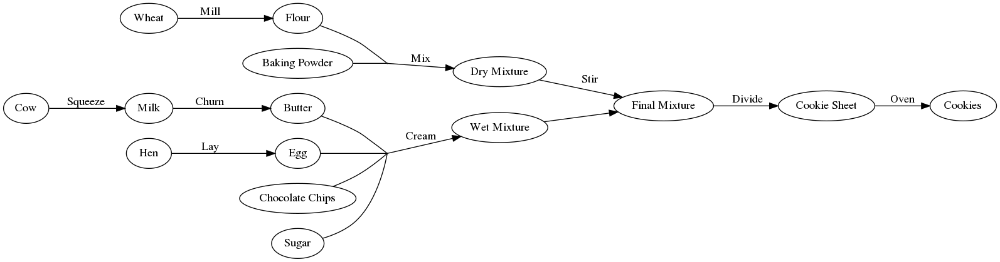

```{r setup, include=FALSE}
library(DiagrammeR)
library(stringr)
options(htmltools.dir.version = FALSE)
knitr::opts_chunk$set(
  fig.width=9, fig.height=3.5, fig.retina=3,
  out.width = "100%",
  cache = FALSE,
  echo = TRUE,
  message = FALSE, 
  warning = FALSE,
  hiline = TRUE
)
```

```{r xaringan-themer, include=FALSE, warning=FALSE}
library(xaringanthemer)
style_duo_accent(
  primary_color = "#1381B0",
  secondary_color = "#FF961C",
  inverse_header_color = "#FFFFFF",
  text_font_size = "1.25rem"
)

```

## Lesson 1

1. Why Snakemake?
2. Introducing Workflows
3. Workflow Syntax
4. Running Snakemake
5. Assignment 1

---

## Why Snakemake?

.left-column[

**Automation**

Reproducibility

Others' Snakefiles

]

.right-column[
Front-loading your effort.

Modest investment at the beginning of a project yields a hands-off tool for
performing routine analyses.

]

---

## Why Snakemake?

.left-column[

Automation

**Reproducibility**

Others' Snakefiles

]

.right-column[
Guarantee that the same inputs will give the same outputs.

Altering any input will make Snakemake re-evalutate the outputs.

Built-in version tracking.
]

---

## Why Snakemake?

.left-column[

Automation

Reproducibility

**Others' Snakefiles**

]

.right-column[
Understand and modify the tools others have created for you.
]

---
## Baking with Graphs


---
## Thinking Backwards

- Snakemake figures out how to achieve the desired result:
  - starts at the final product
  - works backwards until it finds what it needs

- A collection of dependencies not a sequence of instructions

- You tell it how to convert each input to each output

---
## Thinking Backwards


---
## Thinking Backwards


---
## Thinking Backwards


---
## Thinking Backwards


---
## Thinking Backwards


---
## Thinking Backwards



---
## Rules for Baking

```python
rule all:
    input: "cookies"

rule bake_cookies:
    input: "pan/dough.blobs"
    output: "cookies"
    shell: "oven -i {input} -o {output} --temp 350 --time 15"

rule apportion_dough_blobs:
    input: "bowls/final.mix"
    output: "pan/dough.blobs"
    shell: "scoop -n 24 {input} > {output}"
    
rule combine_bowls:
    input: wet="bowls/wet.mix", dry="bowls/dry.mix"
    output: "bowls/final.mix"
    shell: "mixer {input.wet} {input.dry} > {output}"
```

---
## Baking → Bioinformatics
```{r, basic-mlst-workflow, echo=FALSE}
binfx_dot_simple <- '
digraph {
  rankdir=LR;
  fastq[label="FASTQ"];
  fasta[label="Genome FASTA"];
  alleles[label="Core Alleles", shape="MRecord"];
  calls[label="Calls Table"];
  
  dummy[shape=point, width=0.01, height=0.01];
  fastq -> fasta [label = "SPAdes"];

  alleles -> dummy[dir = none, style="dashed"];
  fasta -> dummy[dir = none];
  dummy -> calls[label = "MLST"];
  
}
'
grViz(binfx_dot_simple)
```

---
## Multiple Samples

```{r, echo=FALSE}
binfx_dot_expanded <- '
digraph {
rankdir=LR;
alleles[label="alleles/aspA.fasta … uncA.fasta", shape=MRecord];
calls[label="calls.tsv"];

fastqA[label="fastqs/genomeA.fastq"];
fastqB[label="fastqs/genomeB.fastq"];
fastqC[label="fastqs/genomeC.fastq"];

fastaA[label="assemblies/genomeA/contigs.fasta"];
fastaB[label="assemblies/genomeB/contigs.fasta"];
fastaC[label="assemblies/genomeC/contigs.fasta"];

mlstA[label="mlst_results/genomeA.tsv"];
mlstB[label="mlst_results/genomeB.tsv"];
mlstC[label="mlst_results/genomeC.tsv"];

fastqA -> fastaA [label="SPAdes"];
fastqB -> fastaB [label="SPAdes"];
fastqC -> fastaC [label="SPAdes"];

dummyA[shape=point, width=0.01, height=0.01];
dummyB[shape=point, width=0.01, height=0.01];
dummyC[shape=point, width=0.01, height=0.01];
dummyD[shape=point, width=0.01, height=0.01];

fastaA -> dummyA [dir=none];
fastaB -> dummyB [dir=none];
fastaC -> dummyC [dir=none];
alleles -> {dummyA, dummyB, dummyC} [dir=none, style="dashed"];

dummyA -> mlstA [label="MLST"];
dummyB -> mlstB [label="MLST"];
dummyC -> mlstC [label="MLST"];

{mlstA, mlstB, mlstC} -> dummyD [dir=none];
dummyD -> calls [label="combine"];
}
'

grViz(binfx_dot_expanded)
```

---
## Rules for Multiple Samples

```python
from pathlib import Path
sample_names = [fq.stem for fq in Path("fastqs").glob("*")]

rule all:
    input: "calls.tsv"
    
rule assemble:
    input:
        fwd="fastqs/{sample}/{sample_1.fastq}", rev="fastqs/{sample}/sample_2.fastq"
    output: "assemblies/{sample}/contigs.fasta"
    shell: "spades -1 {input.fwd} -2 {input.rev} -o assemblies/{wildcards.sample}"

rule get_sequence_types:
    input: "assemblies/{sample}/contigs.fasta"
    output: "mlst_results/{sample}.tsv"
    shell: "mlst --scheme campylobacter {input} > {output}"
    
rule combine_mlst_results:
    input: expand("mlst_results/{sample}.tsv", sample=sample_names)
    output: "calls.tsv"
    shell: "cat {input} > {output}"
```
---
## Threads

- Many (but not all!) bioinformatics tools use multiple CPU threads
- `threads` directive defaults to `1`
    - Accessible in the `shell` block, similar to `input` and `output`
      - `{threads}`

```python
rule annotate_genome:
    input: "genomes/{sample}.fasta"
    output: "annotations/{sample}/{sample}.gff"
    threads: 8
    shell: "prokka --cpus {threads} -o annotations/{wildcards.sample} {input}"
```

---
## Running Snakemake (Basic)

The **basic invocation** of Snakemake:
```bash
snakemake --jobs <number of parallel jobs> -s <path to your Snakefile> -d <work directory>
```

Example populated with real values:
```bash
snakemake --jobs 5 -s ~/snakefiles/assemble.smk -d ~/Projects/cj_population_study
```
---
## Running Snakemake (Caveats)

### Directory Structure

- Workflows tightly coupled to any directory structure described within
- Will implicitly create any directories it needs
    - No need for `mkdir`

### Independent Jobs

- Failure of any job will abort all other jobs
    - Override with `--keep-going`
    - Dependent jobs will still await all inputs
    - _e.g._ if stiring the dry cookie mixture fails, the wet mixture still gets made, but nothing goes in the oven
---

## Running Snakemake on Waffles

- Snakemake can be run on HPCs like **Waffles**
  - _Must_ be combined with Slurm
    - _Don't run it on the head node!_

- Two parts:
  1. Tell Snakemake how to submit jobs with `--cluster`
  2. Submit Snakemake itself as a Slurm job

---
## Running Snakemake on Waffles

The `--cluster` argument:

- Create a template command to pass to **Slurm**
- May access Snakemake special variables like `{threads}`
    - **More on this later**
    
`--cluster 'sbatch -c {threads} --mem 12G --partition NMLResearch '`

---
## Running Snakemake on Waffles

Submitting the Snakemake job to Slurm:

`sbatch -c 1 --mem 4G --wrap "snakemake --jobs 5 -s ~/snakefiles/assemble.smk -d ~/Projects/cj_population_study --cluster 'sbatch -c {threads} --mem 12G --partition NMLResearch '"`
---
## Assignment 1

Write a Snakemake workflow that does the following:

1. Run Prokka on each genome
2. Symlink GFF annotations into `gffs/`
3. Build a pangenome with PIRATE

---
# Lesson 2

